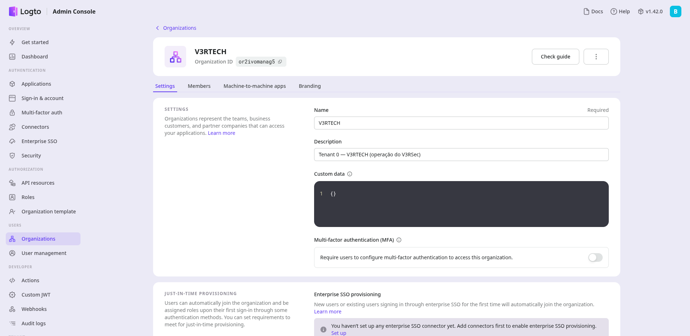
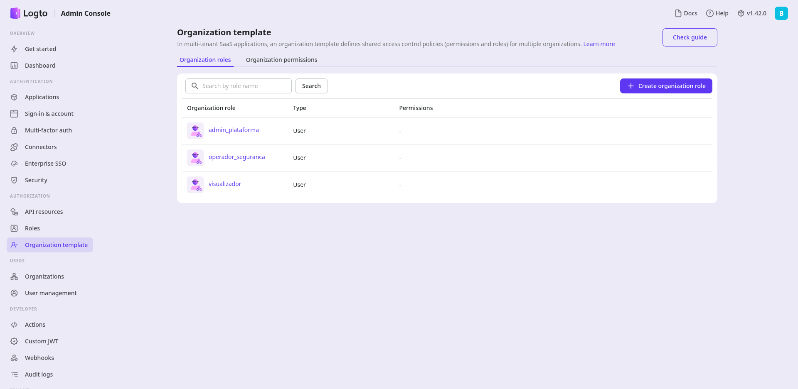

# Bootstrap do Logto (passo manual obrigatorio)

O V3RSec usa o **Logto** como serviço de identidade (login, sessão, recuperação, futura
MFA). A integração no código já está pronta, mas o Logto começa "vazio": ele precisa de uma
configuração inicial feita **uma única vez, manualmente**, no console de administração.
Enquanto isso não for feito, **o V3RSec não autentica ninguém** — o login não passa.

> Este é um passo de **credencial/configuração**, não de código. É o item `FND-AUTHN-SETUP`
> do backlog, marcado como pendente (manual).

## Antes de começar

- O V3RSec (incluindo o container do Logto) precisa já estar no ar — veja
  [Colocar o V3RSec de pe](colocar-de-pe.md).
- Você vai acessar o **console admin do Logto**, por padrão em `http://localhost:3302`
  (variável `LOGTO_ADMIN_ENDPOINT`).

## Passo a passo

### 1. Criar a primeira conta administradora

No primeiro acesso ao console admin do Logto, ele pede para você **criar a conta de
administrador** do próprio Logto. Essa é a conta que gerencia o serviço de identidade.


### 2. Criar a organização (= tenant V3RTECH)

No V3RSec, **uma organização do Logto corresponde a um tenant**. Crie a organização da
**V3RTECH** (o tenant 0). É ela que, no futuro, permite isolar clientes externos em tenants
próprios.



### 3. Criar o aplicativo de login (SPA) para o PWA

Crie um **aplicativo do tipo SPA** (single-page application) para o PWA do V3RSec. O Logto
gera um **App ID** — copie-o para a variável `VITE_LOGTO_APP_ID` no seu `.env`. (Apps SPA do
Logto não usam client secret; o App ID é público.) Configure a **URL de redirect** do login
para a rota `/callback` do PWA.

### 4. Registrar o recurso de API do backend

Crie um **API Resource** no Logto com exatamente o mesmo identificador configurado em
`LOGTO_API_RESOURCE` (padrão `urn:v3rsec:api`). É esse "audience" que o backend Deno valida
no token OIDC (via JWKS) para autorizar as chamadas do PWA.



### 5. Reconstruir o PWA (se mudou o App ID)

Como o `VITE_LOGTO_APP_ID` é lido no build do PWA, se você o preencheu/alterou agora,
reconstrua o container do PWA para o novo valor entrar em vigor:

```bash
docker compose up -d --build v3rsec-pwa
```

## Validar

Abra o PWA (`http://localhost:8080`), faça login com uma conta do Logto e confirme que você
cai na tela inicial do V3RSec (**Saúde dos alvos**). Se o login não abrir ou não retornar,
revise os passos 3 e 4 (App ID, redirect `/callback` e API Resource batendo com o `.env`).

## O que ainda é manual / futuro

- **Onboarding programático de organização** (criar org via Management API do Logto,
  vinculando org ↔ tenant automaticamente) ainda é um stub — hoje o vínculo é manual.
  Exige uma credencial **M2M de admin** do Logto (`LOGTO_MANAGEMENT_API_M2M_*`), fora do
  escopo desta fatia.
- **Seleção de tenant** para um usuário que pertence a **várias organizações** ainda não
  existe — o V3RSec usa a primeira organização do token.
